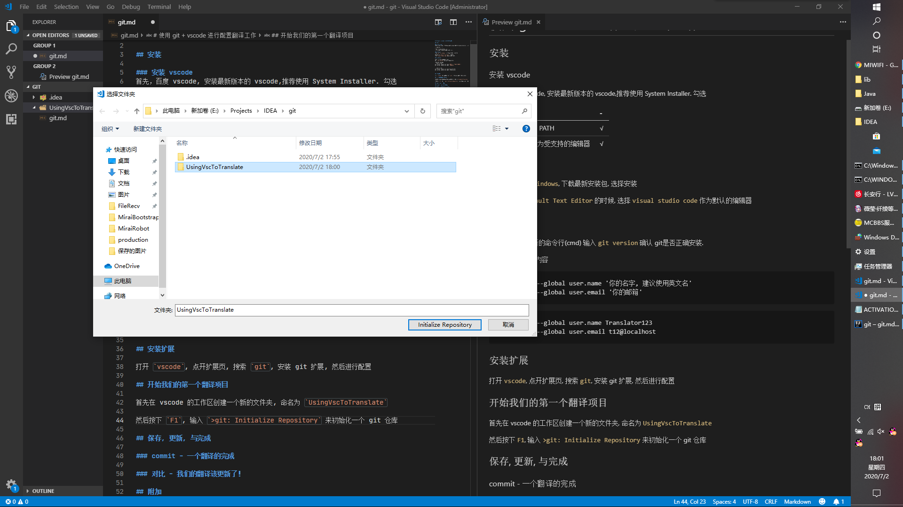
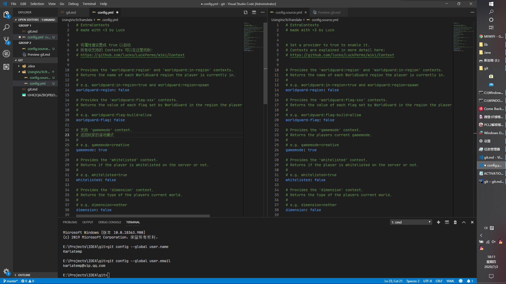
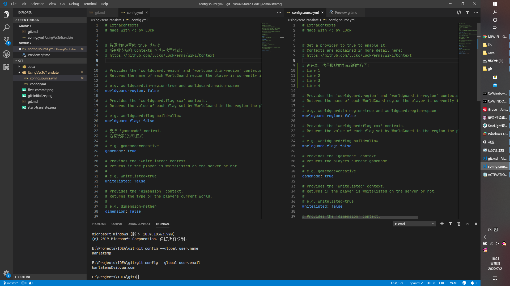

# 使用 git + vscode 进行配置翻译工作

## 安装

### 安装 vscode
首先，百度 vscode, 安装最新版本的 vscode,推荐使用 System Installer. 勾选

| 功能选择 | - |
| :---- | :---- |
| 添加 vscode 至 PATH | √ |
| 将 vscode 注册为受支持的编辑器 | √ |

### 安装 git
百度 `git for windows`, 下载最新安装包, 选择安装

在要求选择 `Default Text Editor` 的时候,
选择 `visual studio code` 作为默认的编辑器

## 初始化 git

首先, 打开一个新的命令行(cmd)
输入 `git version` 确认 git是否正确安装.

然后，输入以下内容
```shell script
git config --global user.name '你的名字, 建议使用英文名'
git config --global user.email '你的邮箱'
```

```shell script
git config --global user.name Translator123
git config --global user.email t12@localhost
```

## 开始我们的第一个翻译项目

首先在 vscode 的工作区创建一个新的文件夹, 命名为 `UsingVscToTranslate`

然后按下 `F1`, 输入 `>git: Initialize Repository` 来初始化一个 git 仓库,
注意仓库位置



## 保存, 更新, 与完成

### 开始我们的翻译工作!

首先, 我们准备好我们需要翻译的东西, 比如 `config.yml`

我们需要创建两个文件, 一个 `config.yml` 一个 `config.source.yml`

然后我们现在开始我们的翻译工作!




### commit - 一个翻译的完成

翻译完成, 我们将我们的修改初春到git仓库中去

点开左边的 `版本控制器`, 对我们的修改进行 commit!

### 对比 - 我们的翻译该更新了！

更新更新! 原文有新内容了! 我们需要 ~~加速~~ 更新

将最新的原文 `config.yml` 覆盖到 `config.source.yml`, 我们能看到以下情况


好啦, 我们已经知道原作者对那些地方进行了修改, 我们能很快就翻译完新的东西!

## 附加

### git log - 查看 commit 树
首先, 我们需要为 vscode 安装扩展 `GitLens`, 然后打开左边的 GitLens, 就能看到 commit 树

### git reset - 回滚回滚! 找到文件的第一个版本!

### gitee/coding - 多人合作!
